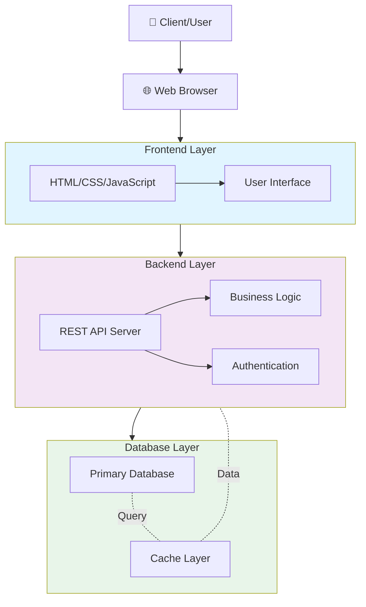

# Web Application Architecture Overview

This document describes the high-level architecture of the web application, including the frontend, backend, and database layers.

## Architecture Diagram

## Components

### Frontend Layer
- **HTML/CSS/JavaScript**: The user-facing presentation layer
- **User Interface**: Interactive components and pages served to the client browser

### Backend Layer
- **REST API Server**: Handles HTTP requests and responses from the frontend
- **Business Logic**: Core application logic and data processing
- **Authentication**: User authentication and authorization mechanisms

### Database Layer
- **Primary Database**: Persistent data storage for application data
- **Cache Layer**: In-memory caching for improved performance and reduced database load

## Data Flow

1. User interacts with the web browser
2. Frontend sends requests to the backend API
3. Backend processes requests using business logic and authentication
4. Backend queries the database or cache layer
5. Database/cache returns data to backend
6. Backend returns response to frontend
7. Frontend renders the response to the user

## Technology Stack

This repository primarily uses:
- **Jupyter Notebook** (81.2%) - For data analysis and experimentation
- **HTML** (15.2%) - For frontend presentation
- **Python** (3.6%) - For backend logic and data processing
